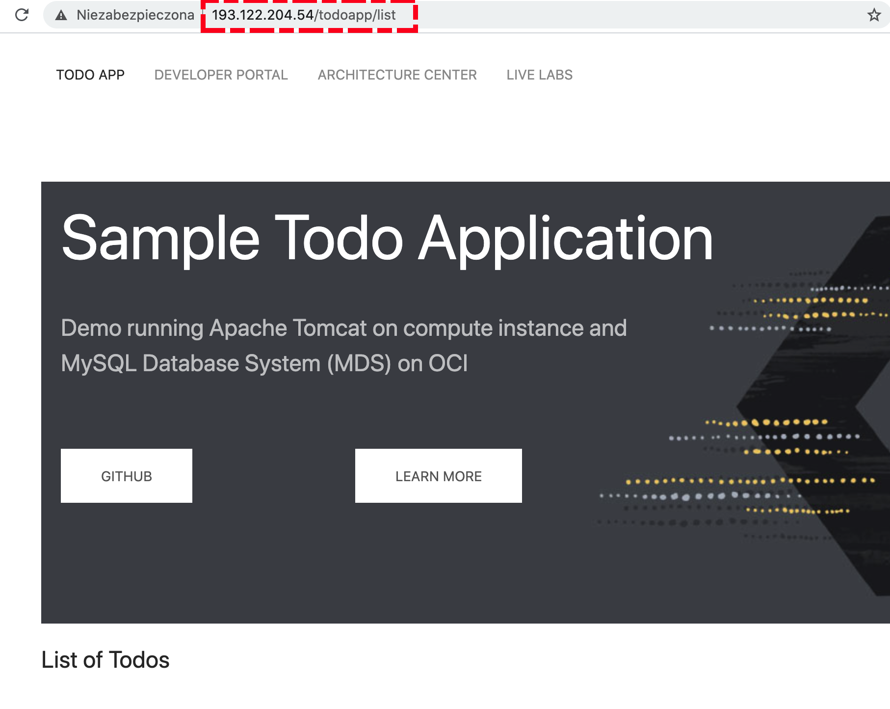

## Create Tomcat multi-node + MDS + custom network & Bastion Service injected into module
This is an example of how to use the oci-arch-tomcat module to deploy Tomcat HA (3 nodes) with OCI MySQL Database System (MDS) and network cloud infrastructure elements + Bastion Service injected into the module. On top of that code will deploy demo JEE application which is using MDS as persistence tier.

### Using this example
Update terraform.tfvars with the required information.

### Deploy the Tomcat
Initialize Terraform:
```
$ terraform init
```

Create a `terraform.tfvars` file, and specify the following variables:

```
# Authentication
tenancy_ocid         = "<tenancy_ocid>"
user_ocid            = "<user_ocid>"
fingerprint          = "<finger_print>"
private_key_path     = "<pem_private_key_path>"

# Region
region = "<oci_region>"

# Compartment
compartment_ocid = "<compartment_ocid>"

# ADB Passwords 
oci_mds_password = "<oci_mds_password>"
oci_mds_admin_password = "<oci_mds_admin_password>"
````

View what Terraform plans do before actually doing it:
```
$ terraform plan
```
Use Terraform to provision resources:
```
$ terraform apply -auto-approve
```

### Testing your Deployment
After the deployment is finished, you can test if your Tomcat have been deployed correctly. You can access the tomcat JEE demo application. Pick up the value of the tomcat_demo_app_URL:

```
tomcat_demo_app_URL = http://193.122.204.54/todoapp/list
```

Then copy it into Web browser. Here is the example of the succesfull outcome:



### Destroy the Tomcat

Use Terraform to destroy resources:
```
$ terraform destroy -auto-approve
```
